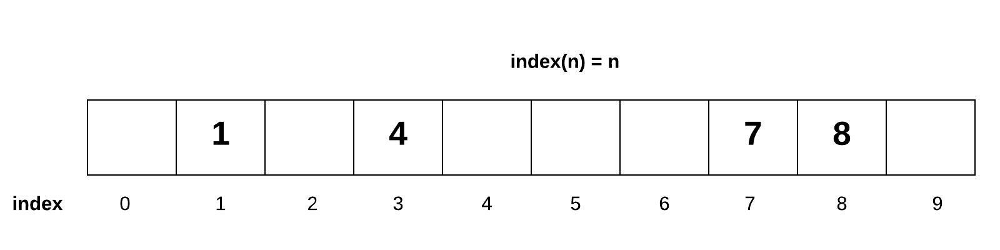
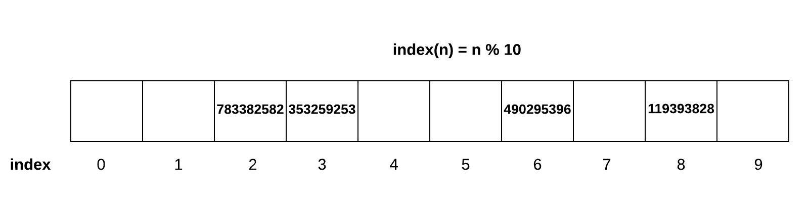
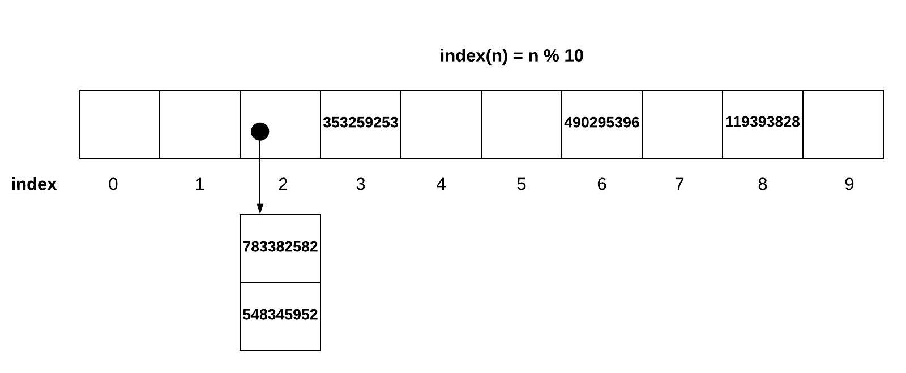

# Sets

## Introduction
Sets are unique from other data structures in a few different ways. Sets will never have duplicate numbers. This is because of their method of storing and retrieving data.

## Hashing

Hashing is the name for a set's technique for storing and retrieving data. Sets require memory to be sequential. However, once memory is allocated to a set it does not need to fill in from left to right

A set can use the value we are trying to store in the set as a refrence for the index value it will be given. For example, if we were storing one digit numbers in a set, we could set the index number equal to the value trying to be stored. If we are to add the integer 5 to this set, we store it at index 5. 

Using this example, if I wanted to know if the numeber 9 was in our set, I know it would be stored at index 9 because of our index rule. So in order to check if the numeber 9 is in our set, I only need to check index 9. This makes it an O(1) performance.

## Larger Numbers and non-numerical items

This rule of indexing works really well for one digit numbers, however, it is not often the case where we only have one digit numbers we are working with.

If we were to use the same method with larger numbers, the number 500 would have to be stored at index 500. If we used the formula index(n) = n % list size. In a list of size 10, 500 % 10 = 0. So the number 500 will be placed at index 0. The number 321 (324 % 10 = 4) will be placed at index 4.

For strings and floats, python has a hashing function that will assign the string a number. A set will then use that number to index the string.

What if we had the number 300 we wanted to add to the list. 300 % 10 = 0, but we already have the number 500 stored at index 0. This is where conflicts arise.

## Conflicts

### Open Addressing:
Open addressing will move the conflicting item over to the right until an open index spot is found. This can be messy because it makes numbers harder to look up and this conflicting value will now be taking the spot of another index value.

### Chaining
When using chaining, when a conflict arises the two conflicting values are placed in a list. The index spot they collided on becomes a pointer to this new list.

## Uses
Sets are very useful when you want a data set that does not have any duplicates. Sets also have very fast performance when adding, removing, and finding values in a set (provided the amount of collisions is not too large).

## Practice Examples

[practice](sets_example.py)

[solution](sets_solution.py)

## Return to welcome page
[Back to welcome page](welcome.md)